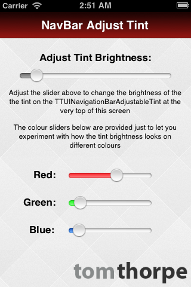

UINavigationBarAdjustableTint
=============================
A subclass of UINavigationBar that allows you to control the level of tint brightness that is applied to the tintColor




Installation
---
* Include the files in the  `Source` directory somewhere in your project.
* Add `#import TTUINavigationBarAdjustableTint.h` in your source wherever you plan to first instantiate - or edit the properties of - your UINavigationBar or UINavigationBarController.
                                                                                                                                                                                                                                                        
Usage
---
### Straight to the point.
`TTUINavigationBarAdjustableTint` is just a subclass of UINavigationBar, with a property called `colourAdjustFactor` which you can set. The lower the number (down to 0) the darker the tint applied to the tintColour. Use `TTUINavigationBarAdjustableTint` where you would normally use UINavigationBar, set the `tintColour`, and `colourAdjustFactor` properties, and you're done. If that makes sense to you, you can stop reading now and get back to making your app! Otherwise, read on... :-)

### If you are using Interface Builder
* Find your UINavigationBar in interface builder (if you are also using a UINavigationBarController, you might need to use the Document Outline window to find it.


* In the Utilities window (on the right hand side), choose the Identity Inspector tab and change the "Class" property of the UINavigationBar to be TTUINavigationBarAdjustableTint instead


 
* Set the `TintColor` property of your navigationBar as you normally would (either in InterfaceBuilder in the Attributes Inspector, or in code).
 

or
```  objc
self.navigationController.navigationBar.tintColor = [UIColor blueColor];
```
 
* When you want to change the tint brightness, either access your instance of the TTUINavigationBarAdjustableTint via the `self.navigationController.navigatonBar` property (if your current view is inside the navigationController), or set up an outlet from Interface Builder to the TTUINavigationBarAdjustableTint, and adjust the `colourAdjustFactor` property (see the "Options" section below for instructions on what value to set it to).

### If you are using Code
* If you normally just instaniate a UINavigationBar, simply instantiate a TTUINavigationBarAdjustableTint instead and use it in exactly the same way.
* If you are using a UINavigationController, instantiate it by calling the  `initWithNavigationBarClass: toolbarClass:` initialiser. For example:

```  objc
UINavigationController *navigationController = [[UINavigationController alloc] initWithNavigationBarClass:[TTUINavigationBarAdjustableTint class] toolbarClass:nil];
```

* Then use your `UINavigationController` as you usually would.
* Adjust the tint brightness by casting the `navigationBar` property of `UINavigationController` to a `TTUINavigationBarAdjustableTint` before changing the `colourAdjustFactor` property. For example:

```  objc
TTUINavigationBarAdjustableTint *navigationBar = (TTUINavigationBarAdjustableTint *)self.navigationController.navigationBar;
    
//set the tint adjustment
navigationBar.colourAdjustFactor = 1.2;
```

* See the "Options" section below for instructions on what value to colourAdjustFactor to.

Options
---
`colourAdjustFactor` - The brightness to adjust the top of the UINavigationBar's gradient, relative to the tintColor property. 
E.g:

* If you set this to 1 the gradient will be a flat colour from top to bottom (no change). It will be the tintColour all over.
* If you set this to 0, the top of the gradient will be black, and the bottom will be the tintColor
* Anything between 0 and 1, the bottom of the gradient will be the tintColor, and the top of the gradient will be darker than the bottom, relative to how close to 0 the value is.
* Anything above 1, the bottom of the gradient will be the tintColor, and the top will be brighter than the bottom relative to how high the number is.
* Try adjusting the brightness slider on the include demo app to see the effect. On the slider, the left and side is 0 and the right hand side is 2. The middle is 1.
 
Demo
---
The included source is an XCode project which you can open to see a demo.

In the Demo, the UINavigationController is first set up to use a `TTUINavigationBarAdjustableTint` as the navigationbar in the `TTAppDelegate.m` `application didFinishLaunchingWithOptions` method.

Then, an instance of the `TintDemo` ViewController is added to the Navigation Controller. Inside `TintDemo.m`'s `viewDidLoad` method an initial `tintColour` and `colourAdjustFactor` value is set, by accessing the views `self.navigationController` property (which I can do because the view has been added to the navigationController in the `TTAppDelegate`).

The values of `tintColor` nd `colourAdjustFactor` are then adjusted using the sliders' `Value Changed` events.

You can refer to these demos for reference of how to use the library if anything is unclear :-)
